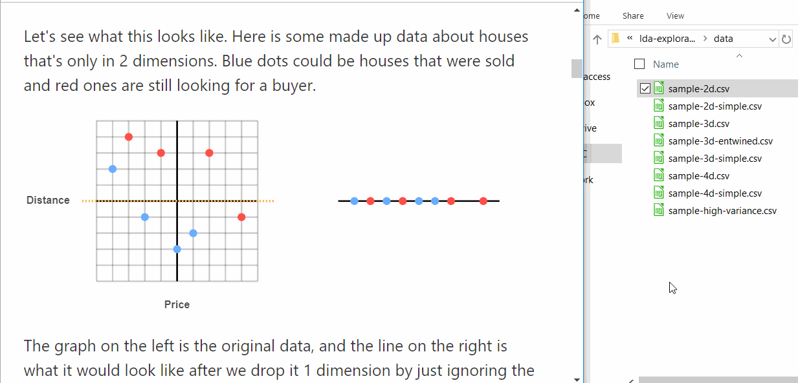
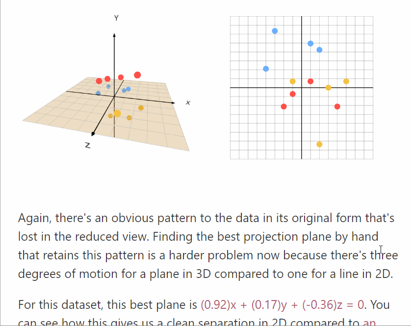
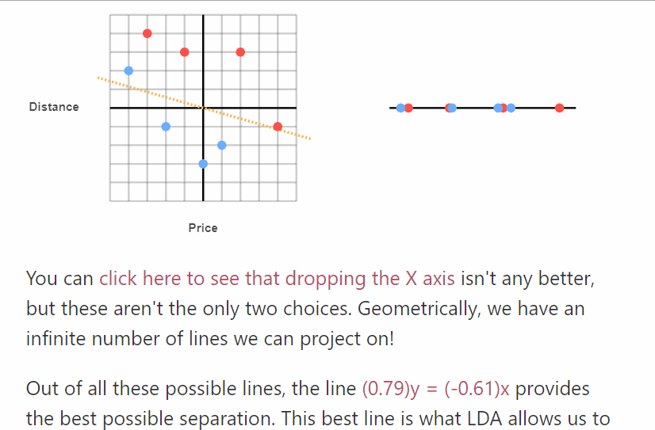
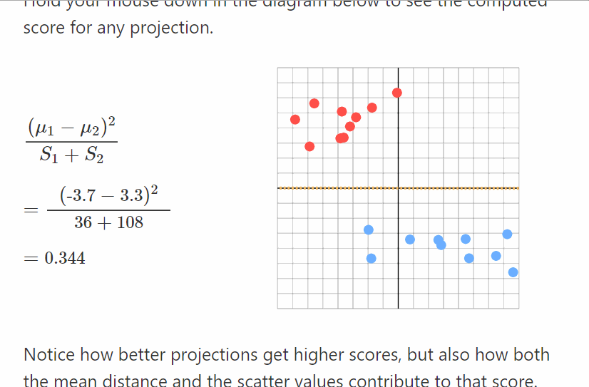

# A Teacher's Guide to "A Geometric Intuition for Linear Discriminant Analysis"

This is an addendum to [A Geometric Intuition for Linear Discriminant Analysis](https://omarshehata.github.io/lda-explorable/) with some tips for using it in the classroom. I wrote this largely to be a useful teaching tool, so a lot of effort was spent on making it easy to adapt to new datasets, illustrate specific concepts or raise questions that students can answer for themselves.

If you end up using this in a classroom and/or have any suggestions or feedback, I'd absolutely love to hear!

### Your Own Data

All interactive diagrams are generated from CSV files in the [data/](https://github.com/OmarShehata/lda-explorable/tree/master/data) directory of this repository. The code for loading these files is in `src/main.js`. 

If you're running your own version of this article you can load your data by editing those files. You can also just drag and drop any CSV file onto the diagrams: 

This will reload the diagram with the new data and recreate any axis labels. It will also recompute relevant links in the text, like the optimal projection line or plane:

This is a great way to quickly show your audience more specific or relevant examples.

In general, if it's an N-dimensional diagram, the first N columns are read as data, with the first row read as labels, and the (N+1)th column is used as the class. Classes can be any string and will be assigned colors in the order that they appear.

### What's "Linear" About LDA?

As an example of something you can illustrate, the article never explicitly explains one caveat about LDA: the classes are assumed to be linearly separable. To show this, you can drop a circular dataset and explore how the optimal separation isn't very good at all:

You can then drop this same dataset in the bottom figure and explore _why_ LDA doesn't work on it:

The means of the two classes lie perfectly on top of each other, no matter which line we pick!

### Jupyter Notebook

For the readers who want to learn how to actually perform LDA themselves, this [Jupyter notebook](https://colab.research.google.com/drive/1mGOcLvZd5SLIsqYzYElQtuD0fhZ2DbHl#scrollTo=1RWac-X4Knby) hosted on Colaboratory shows you how to do it in 2D and 3D for the datasets in the article. Instructions for doing it on the 4D data are at the bottom.

I think it's quite rewarding to get the optimal answer programmatically in Python, and then to go back to the article and rotate the dataset to verify that this projection is indeed possible to achieve just by rotating and projecting. This was something I always "knew", because it was told to me but wasn't something I had the chance to see for myself.

### Exploring Equations 

One of the best ways of understanding the behavior of a new function or formula is by evaluating it at a few specific examples and seeing how it changes as the input changes. I think being able to do this interactively for LDA helps a lot. I think it would be really cool if there was an easy way to set up an equation, drag and drop your data and see it evaluated immediately. This would allow you to quickly design and test new formulas, which is traditionally rare in the classroom. 

This article is far from this vision. I use [MathJax](https://www.mathjax.org) for displaying the equations, which doesn't seem to support updating individual nodes without re-rendering the whole thing as far as I can tell. In order to modify the equation, you'll have to:

1. Modify the LaTeX in `index.html`.
2. Open the page, use the browser inspector to to find the names of the nodes that should be replaced in real time (these will be in the format `#MJXc-Node-XX`).
3. Modify the `updateFormula()` function in `src/main.js` to compute what you need out of the data and display it.
